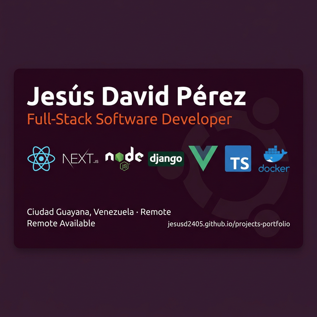

# 🐧 Ubuntu 24.04 LTS Portfolio

<div align="center">
  
  <p><i>Un portafolio web moderno y dinámico inspirado en la interfaz de usuario de Ubuntu 24.04 LTS (Noble Numbat).</i></p>
</div>

---

## 🌟 Descripción

Este proyecto es una **Landing Page de tipo Portafolio** desarrollada con **Next.js 15+** y **Chakra UI v3**. La interfaz emula un entorno de escritorio **GNOME** completo, proporcionando una experiencia de usuario única e interactiva que refleja mi perfil como desarrollador apasionado por el ecosistema Linux y el desarrollo web.

## ✨ Características Principales

- 🎨 **Interfaz Ubuntu 24.04**: Réplica fiel del diseño de Noble Numbat con bordes redondeados y tipografía Ubuntu.
- 💻 **GNOME Desktop Emulation**:
  - **Top Bar**: Con reloj funcional, indicadores de estado y controles.
  - **Dock (Ubuntu Launcher)**: Barra lateral interactiva para navegación rápida entre secciones.
  - **Gestión de Ventanas**: Secciones del portafolio que se abren como ventanas de escritorio con controles de maximizar/minimizar.
- 🐚 **Terminal Animada**: Un componente de terminal interactivo que simula la ejecución de comandos para presentar información técnica.
- 📱 **Diseño Responsive**: Optimizado para dispositivos móviles, tablets y escritorio.
- 🔍 **SEO de Alto Nivel**: Implementación de metadatos, Open Graph, Twitter Cards y generación dinámica de `sitemap.xml` y `robots.txt`.

## 🚀 Comenzando

### Pre-requisitos 📋

- **Node.js**: v18 o superior (recomendado v20+).
- **Docker**: Opcional, para ejecución en contenedores.
- **NPM / PNPM / Bun**: Gestor de paquetes.

### Instalación Local 🔧

1. **Clonar el repositorio:**

   ```bash
   git clone https://github.com/JesusD2405/projects-portfolio.git
   cd projects-portfolio
   ```

2. **Preparar el entorno:**

   ```bash
   cp .env.example .env
   ```

3. **Instalar dependencias:**

   ```bash
   npm install
   ```

4. **Ejecutar en desarrollo:**

   ```bash
   npm run dev
   ```

   Accede a [http://localhost:3000/projects-portfolio/](http://localhost:3000/projects-portfolio/).

### Ejecución con Docker 🐳

Si prefieres usar Docker para un entorno aislado:

```bash
docker compose up --build
```

---

## 🛠️ Construido con

- **[Next.js](https://nextjs.org/)** - Framework de React para producción.
- **[Chakra UI v3](https://chakra-ui.com/)** - Librería de componentes para estilado premium.
- **[Tailwind CSS](https://tailwindcss.com/)** - Utilidades de CSS para diseño rápido.
- **[Framer Motion](https://www.framer.com/motion/)** - Motor de animaciones para transiciones fluidas.
- **[Lucide React](https://lucide.dev/)** - Iconografía moderna y consistente.
- **[Aceternity UI](https://ui.aceternity.com/)** - Componentes de UI avanzados y elegantes.

---

## 📁 Estructura del Proyecto

```text
src/
├── app/                  # Directorio de rutas de Next.js (App Router)
├── components/           # Componentes atómicos y de UI
│   ├── chakra-ui/       # Proveedores y componentes base de Chakra
│   ├── core/            # Componentes del sistema (Dock, Navbar, Window)
│   └── landingSections/ # Secciones de contenido (About, Experience, etc.)
├── helpers/              # Datos estáticos (profile-data.ts) y rutas
├── libs/                 # Librerías externas y utilidades
└── public/               # Assets estáticos (imágenes, iconos, PWA manifest)
```

## ⚙️ Configuración de Datos

Para actualizar la información del portafolio (experiencia, educación, proyectos), simplemente modifica el archivo:
`src/helpers/profile-data.ts`

Los cambios se reflejarán automáticamente en toda la aplicación.

---

## 📦 Despliegue

El proyecto está configurado para desplegarse automáticamente en **GitHub Pages** mediante GitHub Actions cada vez que se hace push a la rama `master`.

Mira el archivo `.github/workflows/deploy.yml` para más detalles sobre el pipeline de CI/CD.

---

## 📄 Licencia

Este proyecto está bajo la Licencia MIT.

Desarrollado con ❤️🚀 por [Jesús David Pérez](https://github.com/JesusD2405)
